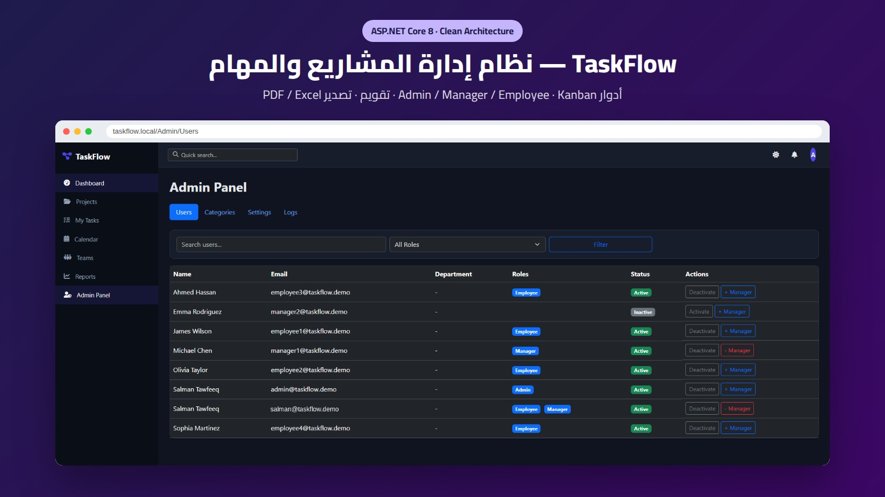
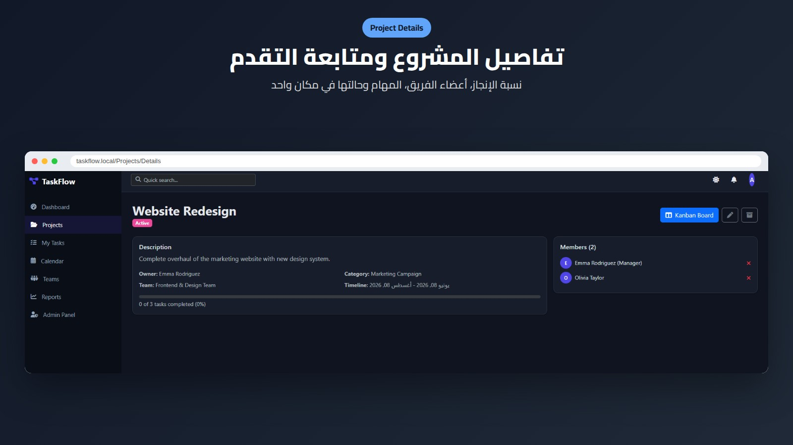

# TaskFlow

[](https://github.com/salmantawfeeq/TaskFlow/actions/workflows/ci.yml)

A full-stack task and project management system built with **ASP.NET Core 8** and **SQL Server**, structured with Clean Architecture.

## Features

- Projects, tasks, checklists, labels, categories and comments
- Teams, departments and role-based access (ASP.NET Core Identity)
- File attachments and in-app notifications
- Dashboard with progress overview
- Reports exportable to Excel (ClosedXML) and PDF (QuestPDF)
- Activity, system and email logging (Serilog)
- Admin area for users, categories, settings and logs

## Screenshots





## Architecture

```
src/
  TaskFlow.Domain          Entities, enums, business exceptions
  TaskFlow.Application     DTOs, service interfaces, validators, mappings
  TaskFlow.Infrastructure  EF Core, repositories, file storage, DI setup
  TaskFlow.Web             MVC controllers and views
tests/
  TaskFlow.UnitTests       xUnit, Moq, FluentAssertions
  TaskFlow.IntegrationTests
database/                  SQL script to create the database
docs/                      ER diagram
```

## Tech Stack

C#, ASP.NET Core MVC, Entity Framework Core 8, SQL Server, ASP.NET Core Identity, AutoMapper, FluentValidation, Serilog, xUnit.

## Getting Started

Prerequisites: .NET 8 SDK and SQL Server (the default configuration uses SQL Server LocalDB, which ships with Visual Studio).

```bash
git clone https://github.com/salmantawfeeq/TaskFlow.git
cd TaskFlow
dotnet restore
dotnet build
dotnet test
dotnet run --project src/TaskFlow.Web
```

The connection string lives in `src/TaskFlow.Web/appsettings.json` (`DefaultConnection`). The database is created and seeded on first start; `database/01_CreateDatabase.sql` is an alternative script for creating the schema manually.

### Demo accounts

The seeder creates a set of demo users so every role can be explored straight away. All of them share the password `Demo@12345` (local/demo use only).

| Role | Email |
| --- | --- |
| Admin | `admin@taskflow.demo` |
| Manager | `manager1@taskflow.demo` |
| Employee | `employee1@taskflow.demo` |

The data model is documented in the [ER diagram](docs/ER-Diagram.md).

Build and tests run automatically on every push through GitHub Actions.

## Author

**Salman Tawfiq** - .NET Developer, Riyadh, Saudi Arabia
[LinkedIn](https://www.linkedin.com/in/salmantawfiq) | [Portfolio](https://salmantawfiq.com)
