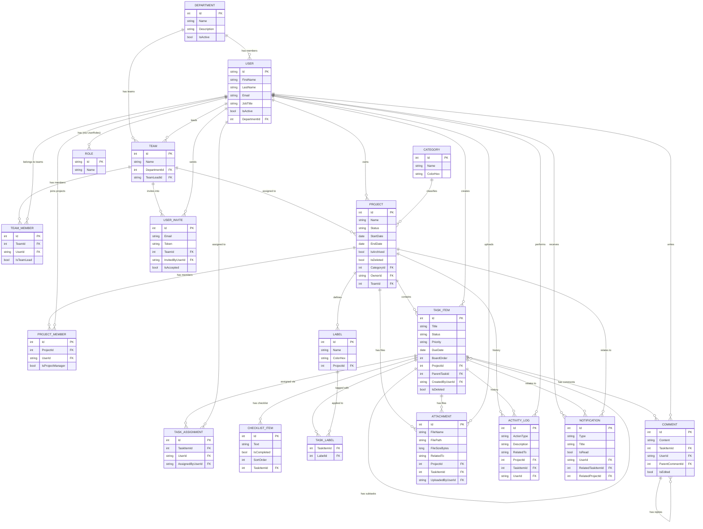

# TaskFlow — Entity-Relationship Diagram

This diagram is written in [Mermaid](https://mermaid.js.org/) syntax and renders
automatically in GitHub's Markdown viewer, VS Code (with the Mermaid extension),
and most modern Markdown tools.

## Notes on modeling decisions

- **Attachment** and **ActivityLog** relate to *either* a Project or a TaskItem
  via two nullable foreign keys (`ProjectId`, `TaskItemId`) rather than true
  polymorphic association. This keeps referential integrity enforceable by
  the database itself, at the cost of one always-null column per row —
  a standard, pragmatic trade-off in relational modeling.
- **TaskItem** self-references via `ParentTaskId` to support subtasks.
- **Comment** self-references via `ParentCommentId` to support reply threads.
- Join tables (`TeamMember`, `ProjectMember`, `TaskAssignment`) are modeled
  as first-class entities (not implicit EF many-to-many) because each one
  carries extra metadata (joined-at date, manager flag, who assigned whom).
- `TaskLabel` is a pure join table with a composite primary key since it
  carries no metadata of its own.
- Not shown for diagram clarity: `SystemLog`, `EmailLog`, `SystemSetting` —
  these are administrative/logging tables with no meaningful FK relationships
  to the core domain graph above.
